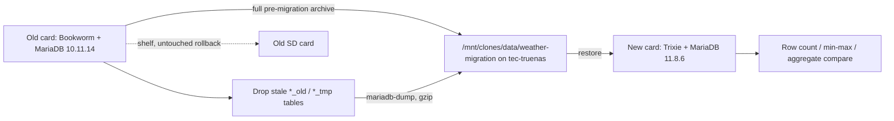

# MariaDB 10.11 to 11.8 station migration

## Approach: logical dump, not a datadir copy

Copy only the `weather` schema as SQL. Do **not** move `/var/lib/mysql`.

An in-place datadir move works in principle (MariaDB supports jumping major versions with `mariadb-upgrade`), but it drags the old `mysql` system database onto the new install, and 10.11 to 11.x upgrades have known collation breakage in the `mysql.user` view ([MDEV-36619](https://jira.mariadb.org/browse/MDEV-36619), [MDEV-36815](https://jira.mariadb.org/browse/MDEV-36815)). A fresh 11.8 install with a logical restore sidesteps all of it, and the only thing lost is the grant table, which is three `CREATE USER`/`GRANT` statements already documented in [docs/SETUP.md](docs/SETUP.md).



## Staging location

Everything lands on the NFS share at `/mnt/clones/data/weather-migration/`, backed by `tec-truenas:/mnt/main/clones`, mounted read-write with 4.8T free. This replaces the earlier scp-to-tec-sdr idea: both Pis already mount it via fstab, so the new card just reads the files back rather than needing a second transfer.

## Schema facts that shape the dump

From [sql/schema/V1_0_0__initial.sql](sql/schema/V1_0_0__initial.sql) and the later migrations:

- All five reading tables are `RANGE` partitioned on `UNIX_TIMESTAMP(read_time)` with yearly partitions through `p2034`. `mariadb-dump` reproduces the `PARTITION BY` clause verbatim, so this survives, but it needs verifying after restore.
- `raw` columns are `JSON` (LONGTEXT + `json_valid()` check) and `battery_ok` is `bit(1)`, so dump with `--hex-blob`.
- `apscheduler_jobs.job_state` is a pickled BLOB. Exclude it; the scheduler rebuilds jobs on startup and a pickle from the old Python is a liability.
- The `pyway` history table must come across intact or `pyway migrate` will try to replay every migration.
- `aqi_clean` in [sql/sp/aqi_clean.sql](sql/sp/aqi_clean.sql) is a stored procedure, so the dump needs `--routines`.
- The live schema has accumulated timestamped `*_old` tables from past cleanup work, and the commented scratch statements at the top of [sql/sp/aqi_clean.sql](sql/sp/aqi_clean.sql) suggest `aqi_sensor_tmp` may be lying around too. These get dropped before the baseline is taken, not carried over.

## Archive first, then drop the stale cleanup tables

Two ordered steps at the very start of Phase 0, both before the inventory baseline is taken.

**Archive.** A logical dump of the entire `weather` schema exactly as it stands today, stale `*_old` tables and all, written to `/mnt/clones/data/weather-migration/weather_premigration_<timestamp>.sql.gz` with a `sha256` sidecar. This is a plain SQL archive rather than a datadir tarball, so it can be restored onto any MariaDB version later if an old table is ever wanted back. It is a one-time keepsake, unrelated to the migration dump that follows.

**Drop.** The canonical table set is exactly what the migrations in [sql/schema/](sql/schema/) create: `outdoor_sensor`, `indoor_sensor`, `aqi_sensor`, `light_sensor`, `pi_metrics`, `sdr_metrics`, `sonic_reading`, `apscheduler_jobs`, and `pyway`. Anything else is a candidate. `scripts/db-stale-tables.sh` lists the strays out of `information_schema.TABLES` with row count, data plus index size, and create time, then emits the matching `DROP TABLE` statements to a separate file rather than executing them. Review the report, confirm nothing unexpected is on the list, then apply the generated drops.

Dropping only after the archive exists and while the old system is still bootable means there are two independent ways back from a bad drop.

## Two version-behavior notes to bake into the runbook

- **Collation.** Since MariaDB 11.5 the default collation for `utf8mb4` is `utf8mb4_uca1400_ai_ci` rather than `utf8mb4_general_ci`. The tables declare `DEFAULT CHARSET=utf8mb4` with no explicit `COLLATE`, so restored tables pick up the new default. Harmless here (the only text columns are `raw`, which is `utf8mb4_bin` via the JSON alias, and the excluded `apscheduler_jobs.id`). Runbook will note the `character_set_collations` my.cnf pin as the opt-out if exact parity is ever wanted.
- **Time zone.** The reading tables use `timestamp`, which is stored UTC and rendered in the session time zone, and `LocalToUTCDateTime` in the app layer assumes a specific local zone. Set the new card's system timezone and confirm `@@global.time_zone` matches the old box *before* restoring, or every historical reading shifts.

## Deliverables

- **[docs/MIGRATION.md](docs/MIGRATION.md)** — the runbook, phased as below, with copy-pasteable commands and a rollback section.
- **`scripts/db-archive.sh`** — one-shot pre-migration archive. Verifies the target directory is writable, dumps everything including the stale tables, gzips, writes a `sha256` sidecar and a small manifest recording server version, timestamp and table list.
- **`scripts/db-stale-tables.sh`** — reports tables outside the canonical set with row counts, sizes and create times, and writes the corresponding `DROP TABLE` statements to a file for review before they are run. Refuses to emit anything unless a matching archive is already present on the share.
- **`scripts/db-inventory.sh`** — run on both sides. Emits per-table `COUNT(*)`, `MIN(read_time)`, `MAX(read_time)`, `MAX(id)` and a numeric aggregate, plus `SHOW CREATE TABLE` and partition list, to a text file for diffing. Uses aggregates rather than `CHECKSUM TABLE`, which is not guaranteed comparable across major versions.
- **`scripts/db-dump.sh`** — the migration dump, taken after the drops:

```bash
mariadb-dump --single-transaction --quick --hex-blob \
  --routines --events --triggers \
  --default-character-set=utf8mb4 \
  --ignore-table=weather.apscheduler_jobs \
  --databases weather \
  | gzip -9 > /mnt/clones/data/weather-migration/weather_$(date +%Y%m%d_%H%M).sql.gz
```

plus a `sha256sum` sidecar file. The archive script above is the same call minus `--ignore-table`, against the uncleaned schema.

- **`scripts/db-restore.sh`** — checksum check, then `gunzip -c … | mariadb` reading straight off the share, then re-applies [sql/sp/aqi_clean.sql](sql/sp/aqi_clean.sql) and reports.
- **Repo updates**: bump [mariadb-docker-compose.yml](mariadb-docker-compose.yml) from `mariadb:10.11.6` (commented "match prod") to `mariadb:11.8`, and update the Bookworm reference in [docs/SETUP.md](docs/SETUP.md) to Trixie with a link to the new migration doc.

## Runbook phases

**Phase 0, on the old card, before anything else.** `sudo systemctl stop weatherwatch weatherdash` to stop writes. Run the archive script and verify its checksum. Run the stale-table report, review the generated drops, apply them. Then run the inventory script — this is the comparison baseline, so it has to be taken after the drops. Run the migration dump. Also copy to the share: `/etc/environment` (holds the DB and Weather Underground creds per [config/etc/environment](config/etc/environment)), any `/etc/mysql/mariadb.conf.d/` drop-ins, and the data dirs the service points at, `/var/lib/weatherwatch/pix`, `/var/lib/weatherwatch/vid`, `/mnt/backup/weather`. Then power down and **shelf the card untouched** — that is the second rollback.

**Phase 1, build the new card.** Trixie image, `apt install mariadb-server` (11.8.6), set timezone, `mariadb-secure-installation`, create the `weather` database and the `weather` / `pyway` users with the grants from [docs/SETUP.md](docs/SETUP.md).

**Phase 2, restore and verify.** Mount the share on the new card, run the restore script against the dump on it, run the inventory script again, diff against the Phase 0 output. Confirm partitions landed via `information_schema.PARTITIONS`. Confirm `aqi_clean` exists. Run `pyway info` and expect the full applied history with nothing pending.

**Phase 3, app cutover.** Clone to `/opt/WeatherWatch`, `poetry install`, restore `/etc/environment`, link the units from [systemd/](systemd/), start, and tail `/var/log/WeatherWatch_err.log`. Sanity check that new rows are landing with sane `read_time` values relative to the migrated history.

**Phase 4, repo commit.** The compose and docs updates above.

## Open item to resolve during Phase 0

Database size is unknown from here, and dropping the stale `*_old` tables may shrink it substantially. The stale-table and inventory steps report both numbers, and if the dump turns out to be large enough that restore time on the Pi is a concern, the runbook will note the fallback of restoring the schema first and loading data per-table in parallel.
